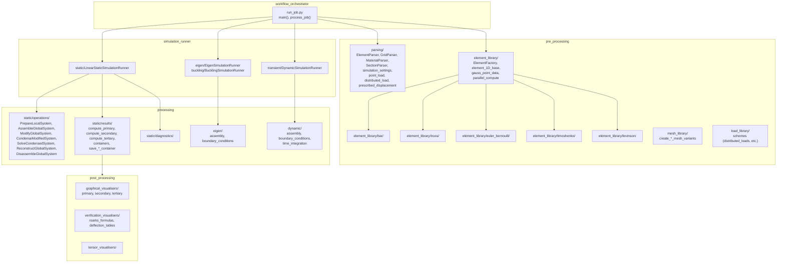

# Component structure

Top-level modules and their main subcomponents. Dependencies flow from job input through pre_processing and processing into the simulation runners; post_processing consumes results.

## Module roles

| Module | Role |
|--------|------|
| **workflow_orchestrator** | Discovers jobs under `jobs/`, creates result dirs, invokes `process_job()` (parsing, element creation, K_e/F_e computation, runner selection and execution). |
| **pre_processing/parsing** | Reads job input files into dictionaries/arrays (element, grid, material, section, settings, loads, prescribed displacements). |
| **pre_processing/element_library** | ElementFactory builds elements; bar, truss, euler_bernoulli, timoshenko, levinson implement K_e and F_e; gauss_point_data and parallel_compute support formulation cache and parallel assembly. |
| **pre_processing/mesh_library** | Mesh generation variants (e.g. create_point_load_mesh_variants, create_distributed_mesh_variants). |
| **pre_processing/load_library** | Load schemes (distributed loads, equivalent line loads, etc.). |
| **processing/static** | Operations (prepare, assemble, modify, condense, solve, reconstruct, disassemble); results (primary, secondary, tertiary); containers; diagnostics. |
| **processing/eigen** | Global **K** / **M** assembly and BCs for eigen, buckling, harmonic (and related). |
| **processing/modal** | Placeholder package only; legacy shims removed — use **processing.eigen**. |
| **processing/dynamic** | Global assembly, boundary conditions, and time integration for transient analysis. |
| **simulation_runner** | **LinearStaticSimulationRunner** (linear static); **NonlinearStaticSimulationRunner** (nonlinear static); **EigenSimulationRunner** / **BucklingSimulationRunner** (eigen/buckling); **DynamicSimulationRunner** in **transient/**; **HarmonicSimulationRunner**; etc. |
| **post_processing** | Scripts that read result directories: graphical (deformation, load, stress, strain, section forces, etc.), verification (Roark, deflection convergence, GCI), tensor visualisers. |
