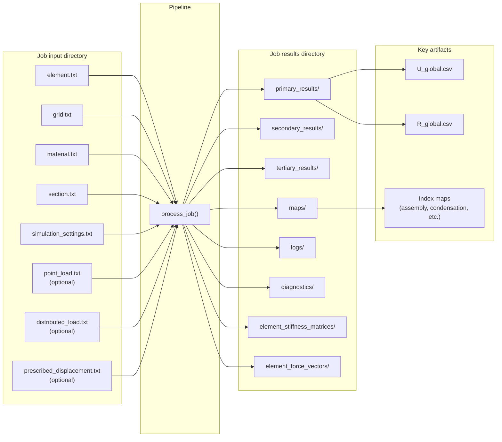

# Data flow

Job input files and result output layout. Each job directory under `jobs/` (e.g. `jobs/job_0000_n10/`) is read by `process_job()`; results are written to a new directory under `post_processing/results/`.

## Input files (job directory)

| File | Required | Parser / usage |
|------|----------|----------------|
| element.txt | Yes | ElementParser — connectivity, element type |
| grid.txt | Yes | GridParser — node IDs, coordinates |
| material.txt | Yes | MaterialParser — E, nu, rho, etc. |
| section.txt | Yes | SectionParser — section properties |
| simulation_settings.txt | Yes | parse_simulation_settings — solver type (static/modal), solver config, parallel options |
| point_load.txt | No | parse_point_load — concentrated loads |
| distributed_load.txt | No | parse_distributed_load — line loads |
| prescribed_displacement.txt | No | parse_prescribed_displacement — fixed/prescribed DOFs |

## Output directory layout

Result root: `post_processing/results/{case_name}_{timestamp}_pid{pid}_{uid}/`

| Subdirectory | Contents |
|--------------|----------|
| primary_results | U_global, R_global, F_global, K_global (or summaries); CSVs per resolution (global, elemental); primary results summary |
| secondary_results | Strain, stress, energy density (Gauss and nodal); secondary summary |
| tertiary_results | Section forces, principal stress, etc.; tertiary summary |
| maps | Assembly, modification, condensation, reconstruction index maps |
| logs | process_job.log, job_performance.log, traceback on failure |
| diagnostics | Linear-static diagnostics, runtime telemetry |
| element_stiffness_matrices | Per-element K_e (from element phase) |
| element_force_vectors | Per-element F_e (from element phase) |

Post-processing scripts (graphical, verification, tensor visualisers) discover results by scanning `post_processing/results/` and parsing job result directory names.
