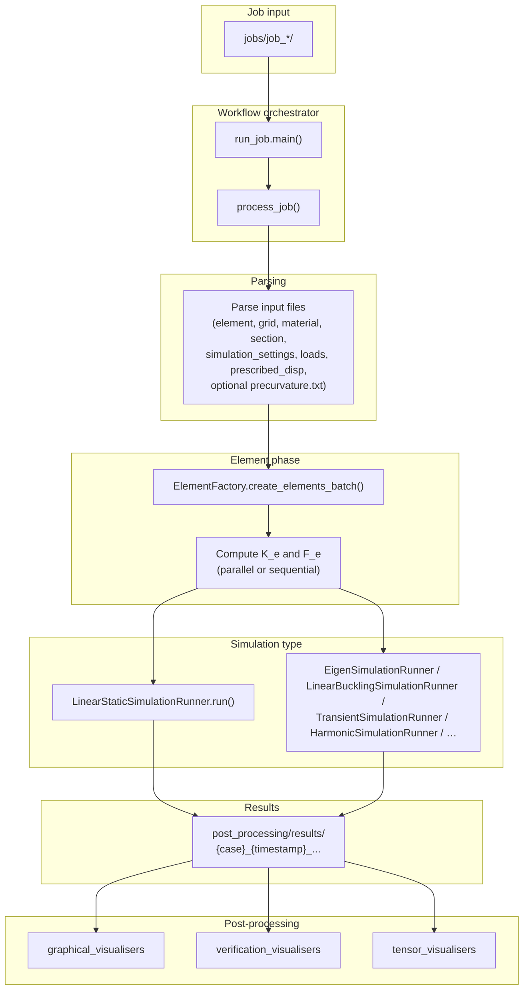

# Pipeline overview

End-to-end FEM pipeline from job discovery through parsing, element creation, simulation execution, and results. The logic is implemented in `workflow_orchestrator/run_job.py` (`main()` and `process_job()`) and the simulation runners under `simulation_runner/`.

- **Job discovery:** `main()` finds all `job_*` directories under `jobs/`, creates a result directory per job, and runs `process_job()` (optionally in parallel).
- **Parsing:** Element, grid, material, section, simulation settings, and optional point/distributed loads and prescribed displacements are read from the job directory.
- **Element phase:** `ElementFactory` builds elements; then element stiffness matrices and force vectors are computed (parallel or sequential per `simulation_settings.parallel`).
- **Simulation:** Branch by `simulation_settings.type` (canonical: `static`, `eigen`, `transient`, `harmonic`, `buckling`; legacy `[Type] modal` / `dynamic` normalize in the parser). See [simulation_runner/README.md](../../simulation_runner/README.md).
- **Results:** Written under `post_processing/results/{case}_{timestamp}_pid{pid}_{uid}/` (primary_results, secondary_results, tertiary_results, maps, logs, etc.).
- **Post-processing:** Separate scripts under `post_processing/` read these results (graphical, verification, tensor visualisers).
