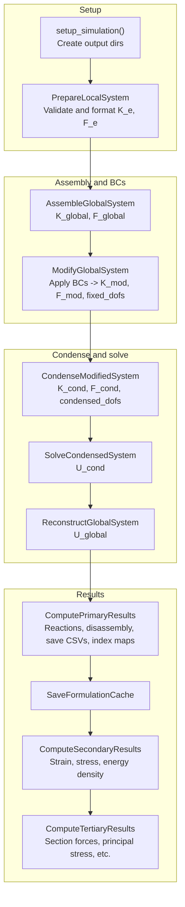

# Static simulation flow

Stage-by-stage linear-static workflow executed by `StaticSimulationRunner.run()` in `simulation_runner/static/static_simulation.py`. Each stage maps to operations in `processing/static/operations/` and result computation in `processing/static/results/`.

## Stage summary

| Stage | Method / component | Outputs |
|-------|--------------------|--------|
| 0 | `setup_simulation()`, `prepare_local_system()` | Dirs; formatted K_e, F_e |
| 1 | `assemble_global_system()` — AssembleGlobalSystem | K_global, F_global, local_global_dof_map |
| 2 | `modify_global_system()` — ModifyGlobalSystem | K_mod, F_mod, fixed_dofs |
| 3 | `condense_modified_system()` — CondenseModifiedSystem | K_cond, F_cond, condensed_dofs, inactive_dofs |
| 4 | `solve_condensed_system()` — SolveCondensedSystem | U_cond |
| 5 | `reconstruct_global_system()` — ReconstructGlobalSystem | U_global |
| 6 | `compute_primary_results()` — PrimaryResultsOrchestrator, DisassembleGlobalSystem, SavePrimaryResults | R_global, U_e, R_e; CSVs and index maps |
| 6.5 | SaveFormulationData | Formulation cache to disk |
| 7 | `compute_secondary_results()` — SecondaryResultsOrchestrator | Strain, stress, energy density (Gauss and nodal) |
| 8 | `compute_tertiary_results()` — TertiaryResultsOrchestrator | Section forces, principal stress, etc. |

Diagnostics (`DiagnoseLinearStaticSystem`, `RuntimeMonitorTelemetry`) run after assembly, after modification, and after condensation; telemetry wraps each stage.
