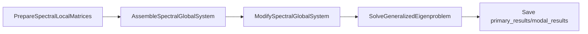

# Spectral backend (Section 2 / Section 5)

**`VibrationBucklingBackend`** ([`vibration_buckling_backend.py`](vibration_buckling_backend.py)) is the shared orchestration for **eigen vibration** and **linear buckling**. It is not a separate public job type; jobs still use **`[Type] eigen`** or **`[Type] buckling`** with [`EigenSimulationRunner`](../eigen/eigen_simulation.py) and [`LinearBucklingSimulationRunner`](../buckling/buckling_simulation.py).

### Supported imports (downstream / extensions)

| Symbol | Module |
|--------|--------|
| **`VibrationBucklingBackend`** | **`simulation_runner.spectral.vibration_buckling_backend`** (also re-exported from **`simulation_runner.spectral`**) |
| **`log_spectral_diagnostics`**, **`log_spectral_constrained_dofs`** | **`simulation_runner.spectral.spectral_diagnostics`** |

Do not import removed **`simulation_runner.modal`** shims; they are gone ([CHANGELOG](../../docs/CHANGELOG.md)).

## Pipeline (vibration)

1. **Prepare** — COO element **K_e**, **M_e** from cached element matrices.  
2. **Assemble** — global **K**, **M** (same penalty BC helpers as Section 2 assembly in `processing.eigen`).  
3. **Modify** — prescribed / penalty BCs on **K**, **M**; logs via [`log_spectral_diagnostics`](../../processing/spectral/spectral_diagnostics.py).  
4. **Solve** — smallest generalized eigenpairs `K x = λ M x`; solver dense/sparse threshold from **`[Eigen] dense_threshold`** (see [SIMULATION_SETTINGS_TAXONOMY.md](../../docs/conventions/SIMULATION_SETTINGS_TAXONOMY.md)).  
5. **Save** — frequencies and mode shapes under **`primary_results/modal_results/`**; optional secondary metrics and formulation-cache post when **`[PostProcessing]`** enables it (see [RESULTS_DESIGN.md](../../processing/static/results/RESULTS_DESIGN.md)).

## Pipeline (buckling)

Prestress (**linear_static** / **nonlinear_static**) produces **U**; then **K_g** assembly, BC modification on **(K, K_g)**, and **`SolveLinearBucklingEigenpairs`**. Primary outputs share the **`modal_results/`** folder name for history: **`{job}_buckling_load_factors.txt`**, **`{job}_buckling_mode_shapes.txt`**.

## Stage mapping vs linear static

[`LinearStaticSimulationRunner`](../static/linear_static_simulation.py) exposes one method per major step (prepare, assemble, modify, condense, solve, reconstruct, disassemble). Spectral jobs follow the **same decomposition idea** where the math matches; some static stages have **no counterpart** on the undamped / frequency / time-integration paths.

| Linear static (`processing.static.operations`) | Eigen vibration | Linear buckling | Harmonic (Section 4) | Transient (Section 3) |
|-----------------------------------------------|-----------------|-----------------|----------------------|-------------------------|
| `PrepareLocalSystem` | `PrepareSpectralLocalMatrices` | Same | COO `K_e` / `M_e` / `F_e` from `element_objects` | (Matrices supplied by job; no separate prepare class) |
| `AssembleGlobalSystem` | `AssembleSpectralGlobalSystem` | Same elastic `K`, then `AssembleBucklingGeometricStiffness` | `AssembleHarmonicStructuralMatrices` + `AssembleHarmonicLoadVector` | `AssembleDynamicGlobalSystem` |
| `ModifyGlobalSystem` | `ModifySpectralGlobalSystem` | `ModifyBucklingGlobalMatrices` | `ModifyHarmonicStructuralMatrices` | `ModifyDynamicGlobalSystem` |
| `CondenseModifiedSystem` | **N/A** (full modified pencil) | **N/A** (dense subspace eigen inside buckling kernel) | **N/A** | **N/A** |
| `SolveCondensedSystem` | `SolveGeneralizedEigenproblem` | `SolveLinearBucklingEigenpairs` | `SolveHarmonicFrequencySweep` | `IntegrateTransientSystem` |
| `ReconstructGlobalSystem` | **N/A** (mode vectors are full global length) | **N/A** | Prescribed DOFs merged inside sweep helpers | **N/A** |
| `DisassembleGlobalSystem` | **Deferred** (per-element mode projections) | Same | Same | Optional future work for `U_e` time series |

[`VibrationBucklingBackend`](vibration_buckling_backend.py) exposes **instance methods** with the same names as these spectral stages so callers can mirror the linear-static runner style (see method docstrings there).

## Cross-links

- [simulation_runner/README.md](../README.md) — dispatch table, telemetry paths.  
- [SIMULATION_SETTINGS_TAXONOMY.md](../../docs/conventions/SIMULATION_SETTINGS_TAXONOMY.md) — **`[Eigen]`**, **`[Buckling]`**, post keys.  
- [RESULTS_DESIGN.md](../../processing/static/results/RESULTS_DESIGN.md) — modal/dynamic/harmonic snapshot post.  
- [Package `processing.spectral`](../../processing/spectral/README.md) — operation modules and `.run()` entry-point convention.
