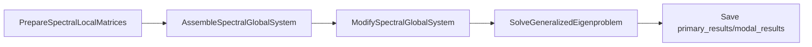

# Spectral backend (Section 2 / Section 5)

**`VibrationBucklingBackend`** ([`vibration_buckling_backend.py`](vibration_buckling_backend.py)) is the shared orchestration for **eigen vibration** and **linear buckling**. It is not a separate public job type; jobs still use **`[Type] eigen`** or **`[Type] buckling`** with [`EigenSimulationRunner`](../eigen/eigen_simulation.py) and [`BucklingSimulationRunner`](../buckling/buckling_simulation.py).

## Pipeline (vibration)

1. **Prepare** — COO element **K_e**, **M_e** from cached element matrices.  
2. **Assemble** — global **K**, **M** (same penalty BC helpers as Section 2 assembly in `processing.eigen`).  
3. **Modify** — prescribed / penalty BCs on **K**, **M**; logs via [`log_spectral_diagnostics`](../../processing/spectral/spectral_diagnostics.py).  
4. **Solve** — smallest generalized eigenpairs `K x = λ M x`; solver dense/sparse threshold from **`[Eigen] dense_threshold`** (see [SIMULATION_SETTINGS_TAXONOMY.md](../../docs/conventions/SIMULATION_SETTINGS_TAXONOMY.md)).  
5. **Save** — frequencies and mode shapes under **`primary_results/modal_results/`**; optional secondary metrics and formulation-cache post when **`[PostProcessing]`** enables it (see [RESULTS_DESIGN.md](../../processing/static/results/RESULTS_DESIGN.md)).

## Pipeline (buckling)

Prestress (**linear_static** / **nonlinear_static**) produces **U**; then **K_g** assembly, BC modification on **(K, K_g)**, and **`SolveLinearBucklingEigenpairs`**. Primary outputs share the **`modal_results/`** folder name for history: **`{job}_buckling_load_factors.txt`**, **`{job}_buckling_mode_shapes.txt`**.

## Cross-links

- [simulation_runner/README.md](../README.md) — dispatch table, telemetry paths.  
- [SIMULATION_SETTINGS_TAXONOMY.md](../../docs/conventions/SIMULATION_SETTINGS_TAXONOMY.md) — **`[Eigen]`**, **`[Buckling]`**, post keys.  
- [RESULTS_DESIGN.md](../../processing/static/results/RESULTS_DESIGN.md) — modal/dynamic/harmonic snapshot post.
